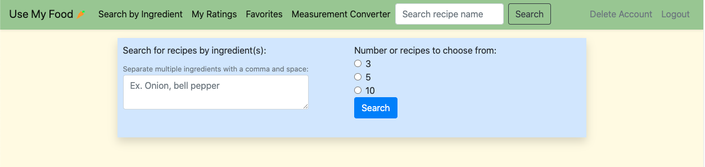

## [Use My Food](https://use-my-food.herokuapp.com/)

#### A web application that allows a user to search for recipes by ingredient(s) or name, favorite and rate recipes, and convert measurements. Built using Python and JavaScript, with data from <https://spoonacular.com/food-api>.

This tool is built with simplicity in mind. At it's core this application is aimed at a user who wishes to use up what's left in the fridge/pantry, and accomplishes this by having a focus on searching for recipes by ingredient. Favoriting recipes gives users a way to save any meals that stick out to them. Rating recipes allows a user to not only keep track of what they thought of a meal for the future, but pass any notes they may have onto other users. 

A user starts by signing up with a username, password and email. From then on, whenever logged in a user may search for recipes, convert measurements, and favorite and rate recipes which will stay associated with their account.

##### Resources Used:

The [Spoonacular API](https://spoonacular.com/food-api) was an invaluable resource for the creation of this project. I would recommend its usage for any application that deals with food.

##### Technology Used:
- Python
- JavaScript
- Flask-SQLalchemy
- Bootstrap
- BeautifulSoup
- WTForms

